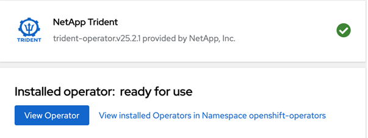

= Installez Trident à l'aide d'OpenShift OperatorHub
:hardbreaks:
:allow-uri-read: 
:icons: font
:imagesdir: ../media/

[role="lead"]
Si vous utilisez Red Hat OpenShift, vous pouvez installer NetApp Trident à l'aide de l'opérateur certifié Red Hat. Suivez cette procédure pour installer Trident à partir de Red Hat OpenShift Container Platform.

.Avant de commencer
Avant de commencer l'installation, link:../trident-get-started/requirements.html["Préparez votre environnement pour l'installation de Trident"].

== Rechercher et installer l'opérateur Trident

.Étapes
. Accédez à OpenShift OperatorHub et recherchez NetApp Trident.
+
image::../media/openshift-operator-01.png[Opérateur Trident]

. Cliquez sur *installer*.
+
image::../media/openshift-operator-02.png[Installez]

. Sélectionnez les options requises et cliquez sur *installer*.
+
image::../media/openshift-operator-03.png[Installez]

. Une fois l'installation terminée, l'opérateur est visible dans la liste des opérateurs installés.
+

. Créez un TORC comme l'installation de l'ensemble opérateur.

== Désinstallez l'opérateur Trident

.Étapes
. Sélectionnez l'opérateur Trident dans la liste des opérateurs installés.
+
image::../media/openshift-operator-05.png[Installez]

. Sélectionnez cette option pour supprimer toutes les instances d'opérande de l'opérateur.
+
image::../media/openshift-operator-06.png[Installé]

+

WARNING: Si vous ne cochez pas la case *Supprimer toutes les instances d'opérande de cet opérateur*, Trident ne sera pas désinstallé.

. Cliquez sur *Désinstaller*.

