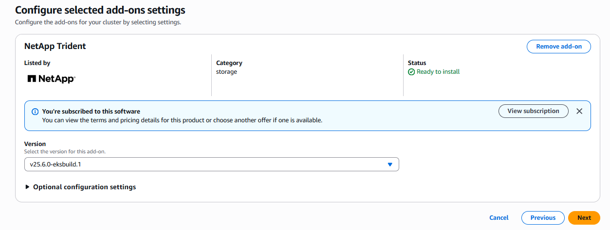
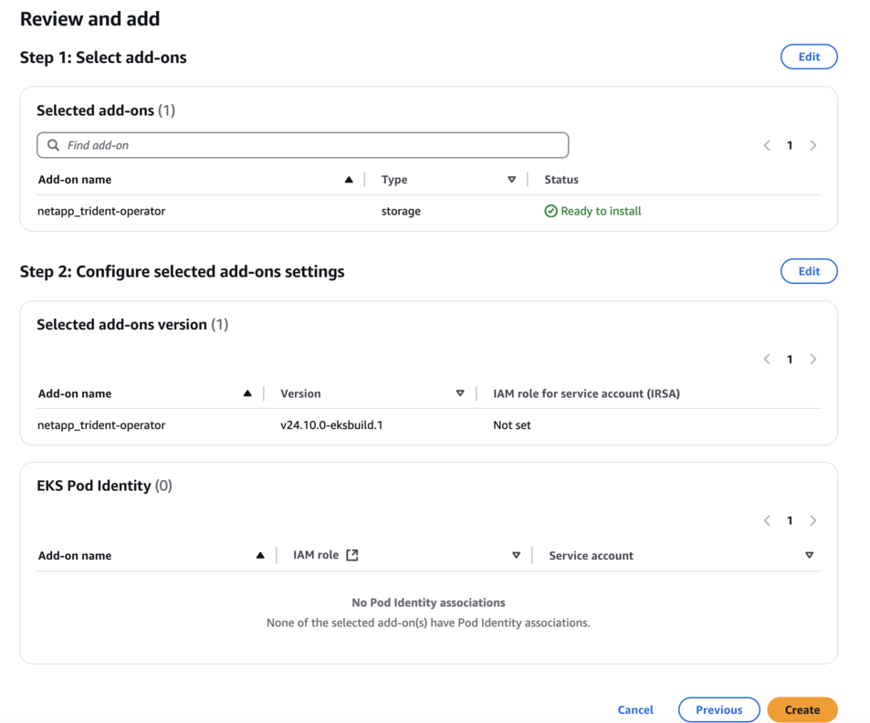

= Configurer le module complémentaire Trident EKS sur un cluster EKS
:hardbreaks:
:allow-uri-read: 
:icons: font
:imagesdir: ../media/

[role="lead"]
NetApp Trident rationalise la gestion du stockage Amazon FSX for NetApp ONTAP dans Kubernetes pour que vos développeurs et administrateurs puissent donner la priorité au déploiement d'applications. Le module complémentaire NetApp Trident EKS inclut les derniers correctifs de sécurité et de bogues, et est validé par AWS pour une utilisation avec Amazon EKS. Le module complémentaire EKS vous permet de vous assurer de manière cohérente que vos clusters Amazon EKS sont sécurisés et stables et de réduire la quantité de travail à effectuer pour installer, configurer et mettre à jour des modules complémentaires.

== Prérequis

Vérifiez les points suivants avant de configurer le module complémentaire Trident pour AWS EKS :

* Un compte de cluster Amazon EKS avec des autorisations d'utilisation de modules complémentaires. Reportez-vous à la link:https://docs.aws.amazon.com/eks/latest/userguide/eks-add-ons.html["Add-ons Amazon EKS"^].
* Autorisations AWS sur AWS Marketplace :
`"aws-marketplace:ViewSubscriptions",
"aws-marketplace:Subscribe",
"aws-marketplace:Unsubscribe`
* Type ami : Amazon Linux 2 (AL2_x86_64) ou Amazon Linux 2 Arm (AL2_ARM_64)
* Type de nœud : AMD ou ARM
* Un système de fichiers Amazon FSX pour NetApp ONTAP

== Étapes

. Veillez à créer un rôle IAM et un code AWS secret pour permettre aux pods d'EKS d'accéder aux ressources AWS. Pour obtenir des instructions, reportez-vous à la section link:../trident-use/trident-fsx-iam-role.html["Créez un rôle IAM et un code secret AWS"^].
. Sur votre cluster EKS Kubernetes, accédez à l'onglet *Add-ons*.
+
image::../media/aws-eks-01.png[eks aws 01]

. Accédez à *add-ons* AWS Marketplace et choisissez la catégorie _Storage_.
+
image::../media/aws-eks-02.png[eks aws 02]

. Localisez *NetApp Trident* et cochez la case du module complémentaire Trident, puis cliquez sur *Suivant*.
. Choisissez la version souhaitée du module complémentaire.
+

. Sélectionnez l'option rôle IAM à hériter du nœud.
+

. Suivez le schéma de configuration *Add-on* et définissez le paramètre valeurs de configuration de la section *valeurs de configuration* sur le fil de rôle que vous avez créé à l'étape précédente (étape 1).
+
La valeur doit être au format suivant : `eks.amazonaws.com/role-arn: arn:aws:iam::464262061435:role/AmazonEKS_FSXN_CSI_DriverRole`.

+

NOTE: Si vous sélectionnez remplacer pour la méthode de résolution des conflits, un ou plusieurs des paramètres du module complémentaire existant peuvent être remplacés par les paramètres du module complémentaire Amazon EKS. Si vous n'activez pas cette option et qu'il y a un conflit avec vos paramètres existants, l'opération échoue. Vous pouvez utiliser le message d'erreur qui en résulte pour résoudre le conflit. Avant de sélectionner cette option, assurez-vous que le module complémentaire Amazon EKS ne gère pas les paramètres que vous devez gérer vous-même.

+
image::../media/aws-eks-06.png[eks aws 06]

. Sélectionnez *Créer*.
. Vérifiez que l'état du complément est _Active_.
+
image::../media/aws-eks-05.png[eks aws 05]

. Exécutez la commande suivante pour vérifier que Trident est correctement installé sur le cluster :
+
[listing]
----
kubectl get pods -n trident
----
. Poursuivez l'installation et la configuration du système back-end de stockage. Pour plus d'informations, voir link:../trident-use/trident-fsx-storage-backend.html["Configurez le back-end de stockage"^].

== Installez/désinstallez le module complémentaire Trident EKS à l'aide de l'interface de ligne de commande

.Installez le module complémentaire NetApp Trident EKS à l'aide de l'interface de ligne de commande :
L'exemple de commande suivant installe le module complémentaire Trident EKS :
`eksctl create addon --cluster clusterName --name netapp_trident-operator --version v24.10.0-eksbuild.1` (avec une version dédiée)

.Désinstallez le module complémentaire NetApp Trident EKS à l'aide de l'interface de ligne de commande :
La commande suivante désinstalle le module complémentaire Trident EKS :

[listing]
----
eksctl delete addon --cluster K8s-arm --name netapp_trident-operator
----