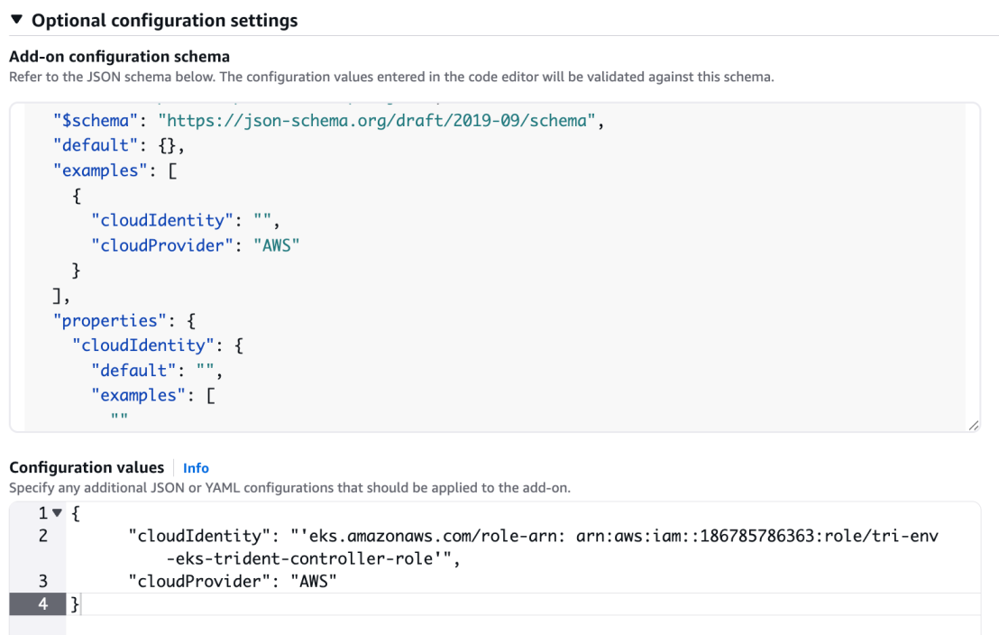

= Configurez le module d'extension Astra Trident EKS sur un cluster EKS
:hardbreaks:
:allow-uri-read: 
:icons: font
:imagesdir: ../media/

[role="lead"]
ASTRA Trident simplifie la gestion du stockage Amazon FSX pour NetApp ONTAP dans Kubernetes pour que vos développeurs et administrateurs puissent donner la priorité au déploiement d'applications. Le module complémentaire Astra Trident EKS inclut les derniers correctifs de sécurité et de bogues, et il est validé par AWS pour fonctionner avec Amazon EKS. Le module complémentaire EKS vous permet de vous assurer de manière cohérente que vos clusters Amazon EKS sont sécurisés et stables et de réduire la quantité de travail à effectuer pour installer, configurer et mettre à jour des modules complémentaires.

== Prérequis

Vérifiez les points suivants avant de configurer le module complémentaire Astra Trident pour AWS EKS :

* Un compte de cluster Amazon EKS avec abonnement complémentaire
* Autorisations AWS sur AWS Marketplace :
`"aws-marketplace:ViewSubscriptions",
"aws-marketplace:Subscribe",
"aws-marketplace:Unsubscribe`
* Type ami : Amazon Linux 2 (AL2_x86_64) ou Amazon Linux 2 Arm (AL2_ARM_64)
* Type de nœud : AMD ou ARM
* Un système de fichiers Amazon FSX pour NetApp ONTAP

== Étapes

. Sur votre cluster EKS Kubernetes, accédez à l'onglet *Add-ons*.
+
image::../media/aws-eks-01.png[eks aws 01]

. Accédez à *add-ons* AWS Marketplace et choisissez la catégorie _Storage_.
+
image::../media/aws-eks-02.png[eks aws 02]

. Localisez *NetApp Trident* et cochez la case du module complémentaire Astra Trident.
. Choisissez la version souhaitée du module complémentaire.
+
image::../media/aws-eks-03.png[eks aws 03]

. Sélectionnez l'option rôle IAM à hériter du nœud.
+
image::../media/aws-eks-04.png[eks aws 04]

. (Facultatif) configurez tous les paramètres de configuration facultatifs selon les besoins et sélectionnez *Suivant*.
+
Suivez le schéma de configuration *Add-on* et définissez le paramètre configurationValues dans la section *Configuration Values* sur le fil de rôle que vous avez créé à l'étape précédente (la valeur doit être au format suivant : `eks.amazonaws.com/role-arn: arn:aws:iam::464262061435:role/AmazonEKS_FSXN_CSI_DriverRole`). Si vous sélectionnez remplacer pour la méthode de résolution des conflits, un ou plusieurs des paramètres du module complémentaire existant peuvent être remplacés par les paramètres du module complémentaire Amazon EKS. Si vous n'activez pas cette option et qu'il y a un conflit avec vos paramètres existants, l'opération échoue. Vous pouvez utiliser le message d'erreur qui en résulte pour résoudre le conflit. Avant de sélectionner cette option, assurez-vous que le module complémentaire Amazon EKS ne gère pas les paramètres que vous devez gérer vous-même.

+

NOTE: Lorsque vous configurez le paramètre facultatif `cloudIdentity` , assurez-vous que vous spécifiez `AWS` en tant que `cloudProvider` lors de l'installation de Trident à l'aide du module complémentaire EKS.

+

. Sélectionnez *Créer*.
. Vérifiez que l'état du complément est _Active_.
+
image::../media/aws-eks-05.png[eks aws 05]

== Installez/désinstallez le module complémentaire Astra Trident EKS à l'aide de l'interface de ligne de commande

.Installez le module complémentaire Astra Trident EKS à l'aide de l'interface de ligne de commande :
L'exemple de commande suivant installe le module complémentaire Astra Trident EKS :
`eksctl create addon --cluster K8s-arm --name netapp_trident-operator --version v24.6.1-eksbuild`
`eksctl create addon --cluster clusterName --name netapp_trident-operator --version v24.6.1-eksbuild.1` (avec une version dédiée)

NOTE: Lorsque vous configurez le paramètre facultatif `cloudIdentity` , assurez-vous de spécifier `cloudProvider` lors de l'installation de Trident à l'aide du module complémentaire EKS.

.Désinstallez le module complémentaire Astra Trident EKS à l'aide de l'interface de ligne de commande :
La commande suivante désinstalle le module complémentaire Astra Trident EKS :
`eksctl delete addon --cluster K8s-arm --name netapp_trident-operator`
